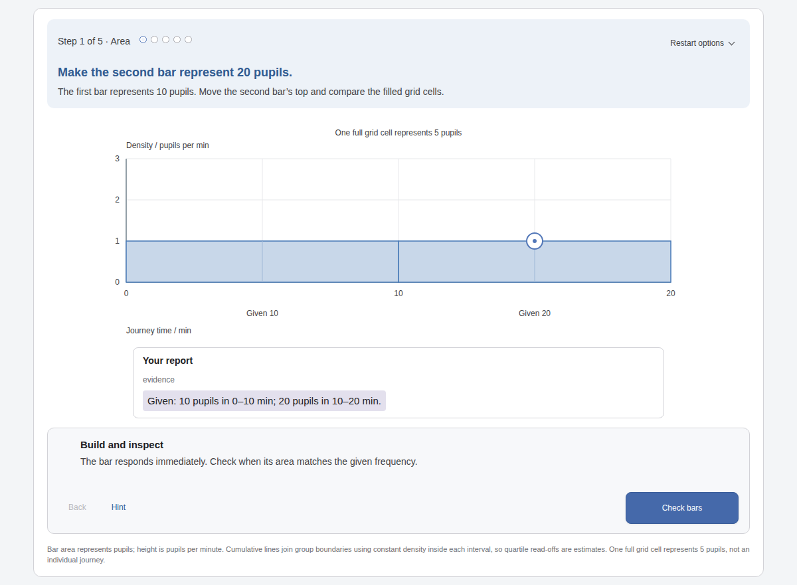
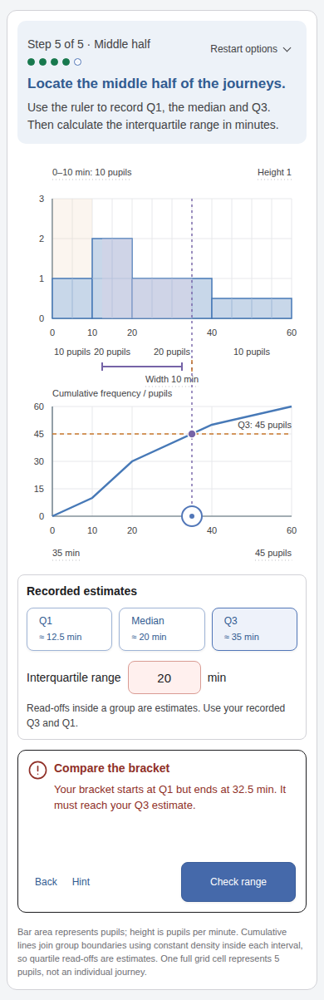
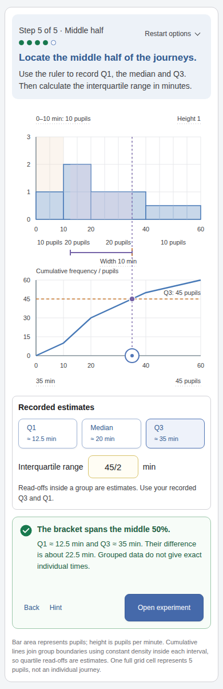
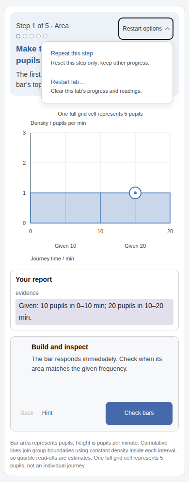

# Histogram and restart review gallery

These screenshots were captured by the passing browser journey using the exact generated review files. They are provided for visual inspection in this pull request. The authoring environment could not display local images during this pass; capture and automated layout checks are not a claim of manual visual review.

## Opening area construction at 1200×800

## Incorrect range with linked evidence at 390×844

## Recorded quartiles and corrected range at 390×844

## Ordered restart actions with their scope descriptions at 390×844

See [workflow and design choices](WORKFLOW-AND-DESIGN.md), [pilot notes](HISTOGRAMS-PILOT.md) and [test evidence](evidence/histograms-and-restart-verification.json).
